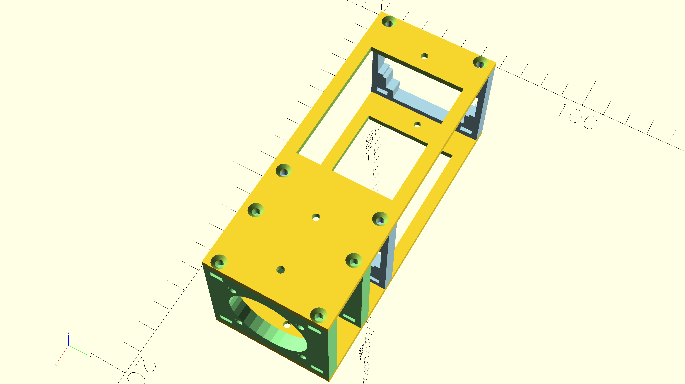
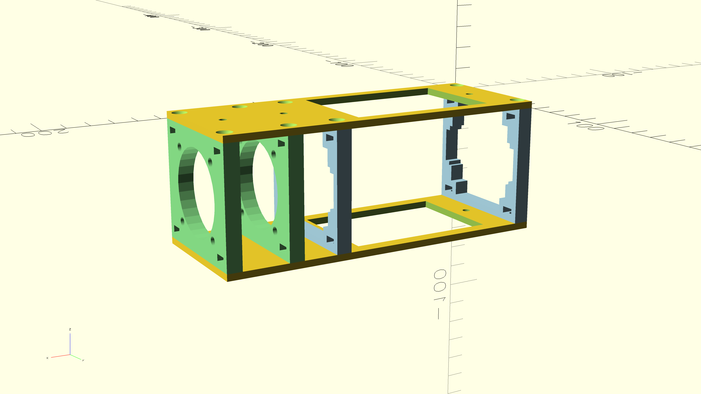
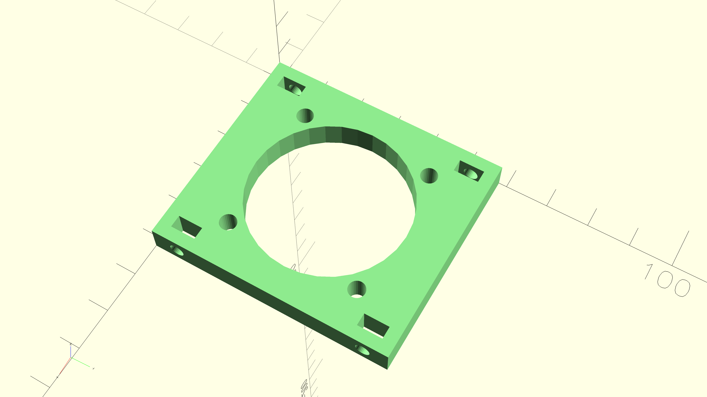
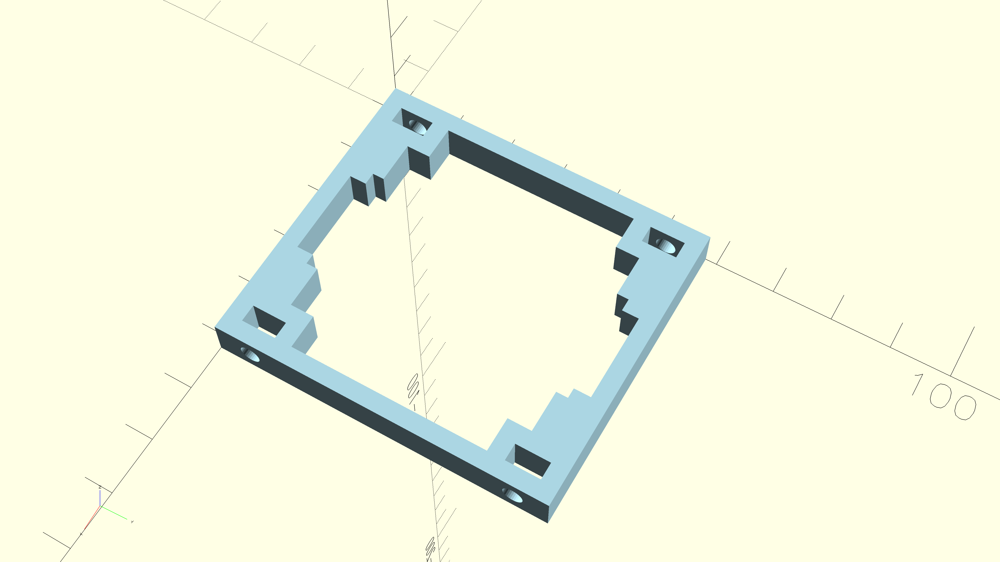

# Design

## Intro

Holder is split into 6 parts, but there are only 3 different sub-objects and each appears twice:

1. top/bottom plate (XY plane)  
2. fan holder plate (YZ plane)
3. disk holder plate (YZ plane)

Each part type will be described as it lies flat on the print bed. This means that top/bottom plate stays laying on XY plane as when assembled, but fan and disk plates are rotated - assembled YZ plane becomes XY plane when printed and described.

Vertical plates (disk/fan) are connected to horizontal ones (top/bottom) using M3 screws (8-10mm) and nuts - `HoriToVertScrew`.

When looking from XZ side of the assembled holder, there are the following objects parallel to the Z axis:

1. first fan plate *(light green)*
2. fan itself
3. second fan plate *(light green)*
4. free space between fan and disk - 5mm (`FanToDiskMargin`)
5. YZ front side of disk (with air outlet) starts
6. first part of disk before first disk plate (`DiskHangingMargin`)
7. first disk plate; distance between 2nd fan plate and 1st disk plate is sum of 4th, 5th and 6th elements here *(light blue)*
8. central part of the disk between 1st and 2nd disk plate (approx 67mm, but this is auto-calculated as `DiskHangingMiddle`)
9. second disk plate *(light blue)*
10. final part of the disk, ending with YZ back side of enclosure with air inlet and Thunderbolt connector - 5mm (`DiskHangingMargin`)

The above elements sum up to `HPD`, which is the longer dimension of the top plate.

Disk plates are not aligned with edges of the enclosure to provide safe tolerations and ensure the disk does not fall off them. 

This means that in current design, part of the disk hangs outside the holder. Rejected alternatives are:

1. extending length of top/bottom plates only, but this provides no benefits, and it's unclear if extension should cover enclosure body with or without Thunderbolt cable
2. extending length of top/bottom plates and adding extra disk plate on very end of holder, but this does not solve issue with cable and adds plastic that doesn't improve holder strength

Strain relief for cable is purposefully left outside the scope of this project, as cables shipped with enclosure are too short and other ones vary too much.

## Architecture

### Top/bottom plates

Top/bottom plates are flat cuboids with flat screw holes for perpendicularly attaching fan+disk plates and non-flat screw holes for vertical stacking. Both types are M3. Flat-head screws are used for smooth external sides, while fall-back to non-flat head is dictated by the fact this connection is made internally in stack and need to simplify model (that way top and bottom plates are identical; otherwise one plate would require conical indentation for screw head and other plate would have no extra cone as it is place for washer + nut).

Additionally, top/bottom plates are hollowed out in a way that keeps the plate rigid and keeps space for pieces of self-adhesive Velcro to allow mounting of the whole holder to a flat surface (widely available tape from TESA is 20mm wide, which also matches the depth of fan).

Height / thickness is 3mm (`HoriPlateThick`), which is arbitrary. Width is determined by width of vertical plates (`HPW=VPW`; effectively the largest hole + margins) and sum of dimensions from vertical plates and distances (`HPD`).

### Virtual vertical plates

Fan and disk holder plates are based of the same "virtual vertical plate" model (*virtual* as in C++ virtual function). Here the base model will be described, it'll not be rendered for printing, but fan and disk plates will use it as base for adding their holes. It is also a flat cuboid, but only has 4 sets of holes. Each hole set is placed around the corner of the plate and consists of:

1. rectangular hole from top to bottom
   - place for nut matching flat-head screw holes in top/bottom plate
   - nut aligned for screw parallel to X axis
   - approximately 6mm (`ConnNutHoleWidth`) in Y and 3mm (`ConnNutHoleDepth`) in X
2. cylindrical hole laying on side (bottom of cylinder is on YZ)
   - place for screw matching flat-head screw holes in top/bottom plate
   - placed in a way that centre of cylinder base is centre of YZ plane of the other hole
   - diameter determined by M3 thread, with some extra margins needed because no supports can be inserted for this overhang (`HoriToVertScrew`)

Height / thickness is 6.75mm (`VertPlateThick`) to accommodate nut (`ConnNutHoleWidth`) and M3 screw hole with safe margins. Size is determined by size of largest hole in appropriate dimension (width/depth) + margins: `VPW` and `VPD`.

At least 3mm (`VertPlateMargin`) are required as margin not to be hollowed to keep structure safe. This value is arbitrary.

### Fan plates

Fan plate has the following cutouts:

1. circular hole for airflow placed in the centre of plate, diameter around 38mm
2. 4 mounting holes for M4 screws, placed on edges of virtual 32x32mm square

Adding extra cutouts adds extra work and doesn't improve airflow.

### Disk plates

The disk plate has the following cutouts:

1. main hole for YZ side of NVMe enclosure
   - base size is 46.1x19.1mm, but we need extra 0.1mm (half of `DiskPadding`) from each side to push enclosure without too much friction (to counteract that, Kapton tape can be used)
   - it's centred
2. 4 extra rectangular holes stacked on top of each other to effectively fully hollow out plate keeping edges needed to keep disk in place and not to interfere with screw holes (this could have been one circle and mounting brackets for disk)
   - extra holes are used here to enhance airflow and limit contact position of disk plate and hot enclosure.
   - they are set up in such a way that each corner of enclosure touching disk plates has a contact length of 2mm (`DiskFrameEdge`) on each side

## Known limitations

1. Airflow is very simplistic; holder was designed to add extra fan as support for built-in one and slightly pull hot air radiating from bottom surface (the one that acts as heat sink for NVMe disk); since this enclosure seems to keep temperatures within my disk ranges (although on higher end) and I don't have knowledge in fluid mechanics I'm not implementing any extra parts yet
2. As mentioned in intro to design, strain relief for Thunderbolt cable is outside of scope of this project; for non-stacked holder placed on top of a surface there shouldn't be any problems even with thick cables, but when stacking or using upside-down some self-adhesive cable guides should be used
3. There's no explicit path for fan cable, but one can use cutouts in disk plates to keep the fan connector around the disk connector
4. In current form, only fixed speed fans make sense, as there's no holder for thermal probe and fan controller in 3D object; moreover, it makes more sense to have one multichannel controller for stackable disk array than to duplicate it and incorporate in every holder
5. Fan power is outside the scope of this project, USB to 3pin / 4pin PWM fan power supplies are widely available (mind the voltage as some fans are 5V and some are 12V, but their connectors are the same)
6. This holder only ensures extra space is kept between enclosure and any adjacent objects (like desk surfaces) and adds fan for stronger airflow; it does not enhance actual heat dissipation - this could be achieved by attaching extra radiators on top and bottom surfaces of enclosure (e.g. using double-sided thermal tape), but it could require tweaking positions of disk plates
